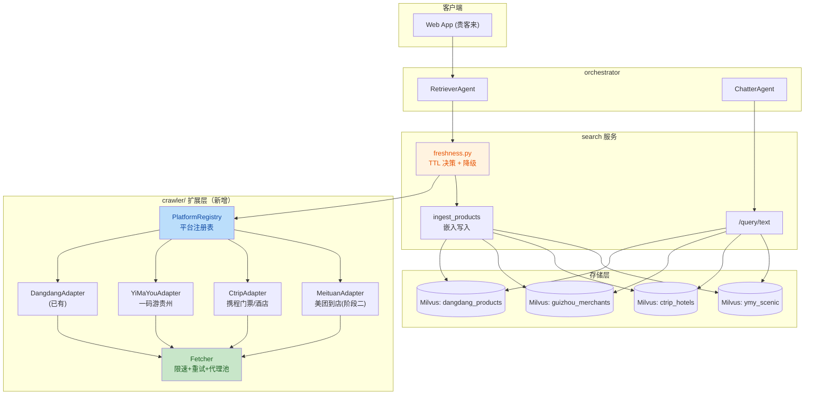
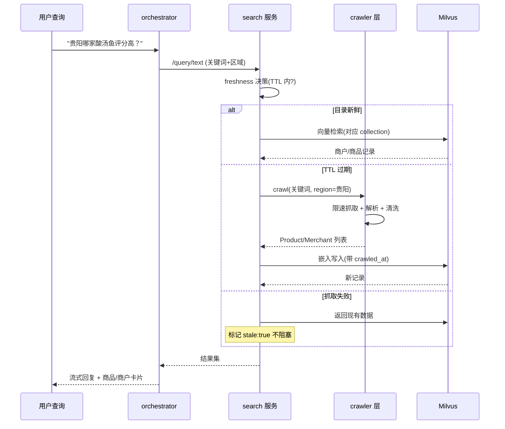

# 贵州生活服务爬虫系统架构设计（第一阶段）

> 版本：v1.0 ｜ 状态：设计评审中 ｜ 负责团队：贵客来 (Guikelai) Shopping-AI
> 基座：复用 upstream 当当爬虫管道（`crawler/` + `search/app/freshness.py`），不另起炉灶。

## 一、目标与范围

为 Shopping-AI 构建贵州本地生活知识库与检索来源，覆盖**衣食住行与本地生活服务**：

- 区域重心：贵阳 / 安顺 / 遵义 / 黔东南 / 黔南 / 毕节 / 铜仁 / 六盘水
- 数据类型：商品（食/衣）、商户（餐饮/评分）、住宿（酒店/民宿）、出行（门票/交通）
- 第一阶段优先落地 2-3 个平台（见"分期路线"）

## 二、现有基座分析（当当管道）

```
crawler/fetcher.py    限速 HTTP 抓取器（2-3s 随机间隔 + 重试 + UA）
crawler/dangdang.py   纯标准库 HTML 解析 → Product dataclass
crawler/categories.py 关键词 → 类目词表
crawler/service.py    编排：关键词+区域 → 多页抓取
crawler/timeutil.py   UTC 时间戳（crawled_at）
search/app/freshness.py  TTL 新鲜度决策 + 失败降级（stale:true）
```

**可复用能力**：限速抓取、重试、解析抽象（`parse_products`）、TTL 新鲜度、Milvus 嵌入写入、`/query/text` 检索链路。
**需扩展能力**：多平台适配、区域标签、商户类数据模型、独立 collection、合规审计字段。

## 三、系统组件图



## 四、数据流程图



## 五、技术选型说明

| 项 | 选型 | 理由 |
|----|------|------|
| HTTP 抓取 | `httpx`（已有 Fetcher） | 现有限速/重试逻辑直接复用 |
| HTML 解析 | 标准库 `html.parser` | 无新依赖，容器体积不变；当当解析器已验证 |
| 平台适配 | `PlatformAdapter` 协议 + 注册表 | 新平台零侵入接入（见可扩展性） |
| 向量存储 | Milvus 独立 collection（每平台） | 按用户清单要求隔离；检索时可跨 collection 联查 |
| 调度 | 按需触发（freshness TTL）+ 可选 cron 预热 | 与现有管道一致，无新增常驻服务 |
| 反爬应对 | 限速(<100 req/h/IP) + UA 轮换 + 代理池接口 | 第一阶段纯公开页；浏览器自动化延后 |
| 合规 | 仅公开数据 + `source`/`crawled_at` 审计字段 | 见"合规红线" |

## 六、数据模型

```python
@dataclass
class Merchant:          # 商户（美团/点评/一码游）
    name: str
    region: str          # 贵阳/遵义/安顺/...
    category: str        # 餐饮/住宿/景点/购物
    rating: float | None
    address: str
    url: str
    platform: str
    crawled_at: str

@dataclass
class Product:           # 商品（当当已有，扩展 region）
    ...                  # 现有字段
    region: str = "贵州"  # 新增区域标签
```

区域词表：`贵阳/遵义/安顺/黔东南/黔南/毕节/铜仁/六盘水`，
组合关键词：`"贵阳 美食"`、`"西江千户苗寨 民宿"`、`"黄果树 门票"`、`"遵义 羊肉粉"`、`"黔东南 蜡染"`。

## 七、分期路线

| 阶段 | 平台 | 方式 | 说明 |
|------|------|------|------|
| **一（本期）** | 当当（已有） | HTTP + 解析 | 关键词加贵州前缀 |
| 一 | 一码游贵州 (01yunyou.cn) | HTTP + 解析 | 官方权威，反爬弱，优先 |
| 一 | 携程门票/酒店（公开页） | HTTP + 解析 | 黄果树/西江千户苗寨门票 |
| 二 | 美团到店/酒店、大众点评 | 浏览器自动化 | 反爬严，需代理池 |
| 二 | 小红书/抖音 | 浏览器自动化 | 内容补充 |
| 三 | 832 平台、邮乐农品 | HTTP | 农产品直供 |

## 八、可扩展性设计

新增平台只需两步（零侵入）：

1. 实现 `PlatformAdapter` 协议：

```python
class PlatformAdapter(Protocol):
    platform: str                                  # 平台标识
    collection: str                                # Milvus collection 名
    def crawl(self, keyword: str, region: str) -> list[Product | Merchant]: ...
```

2. 在 `PlatformRegistry` 注册：`registry.register(YiMaYouAdapter())`

预留接口：
- `Fetcher.proxy_pool: Iterable[str] | None`（阶段二代理轮换）
- `Fetcher.browser: BrowserSession | None`（阶段二浏览器自动化降级路径）
- `freshness.load_freshness_hours()` 已支持每平台独立 TTL（扩展 env：`DATA_FRESHNESS_{PLATFORM}_HOURS`）

## 九、合规红线

- 仅抓取公开可见数据，不碰用户隐私、不绕过登录墙
- 单 IP 每小时 < 100 次请求（现有 2-3s 间隔已满足）
- 每条记录强制携带 `platform` + `crawled_at` + `source`，UI 侧注明数据来源
- 优先抓官方平台（一码游贵州）；商业化平台仅做比价参考并标注来源

## 十、与现有 pipeline 的集成点

- `orchestrator/app/agents/retrieval_proxy.py`：无需改动（走 `/query/text`）
- `search/app/freshness.py`：`CrawlerService` 替换为 `PlatformRegistry.dispatch()`
- `web/`：商品卡片的 `source` 字段展示平台徽章（复用现有"目录灵感"徽章样式）
- 测试基线：`tests/unit/crawler/` 每个新 Adapter 一份解析器快照测试

## 十一、验收标准（第一阶段）

- [ ] 一码游贵州 + 携程门票两个 Adapter 落地，各自有单元测试
- [ ] Milvus 新增 `ymy_scenic` / `ctrip_tickets` collection 并完成入库
- [ ] 查询"黄果树 门票"返回真实门票记录（含价格、来源、crawled_at）
- [ ] 抓取失败时主流程不阻塞（stale 降级路径有测试）
- [ ] 全量测试通过（后端 + 前端），容器端到端验证
